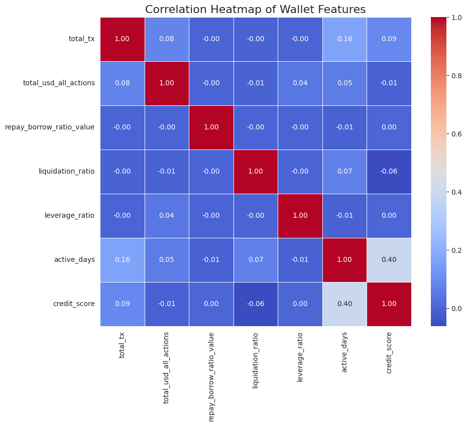
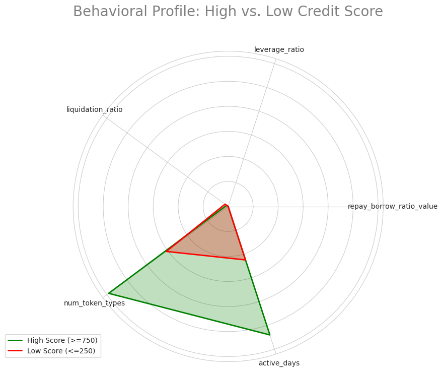

# Analysis of Aave V2 Wallet Credit Scores

## 1. Introduction

This document provides a detailed analysis of the credit scoring system developed for Aave V2 wallets. The primary goal of this analysis is to validate the effectiveness of our model by examining the distribution of the generated credit scores and, more importantly, by dissecting the on-chain behaviors that characterize wallets in different score tiers.

The core challenge of this task lies in its **unsupervised nature**; without pre-existing labels of "good" or "bad" wallets, we must create a scoring system from behavioral patterns alone. To address this, our methodology involved two key phases:

1.  **Advanced Feature Engineering**: We created a rich set of features from the raw transaction data to capture user behavior related to activity, financial health, and risk.
2.  **K-Means Clustering**: We used this unsupervised learning algorithm to group wallets into five distinct behavioral profiles, which were then ranked based on a "health metric" to produce a final credit score between 0 and 1000.

This analysis will demonstrate that the resulting score is a meaningful and reliable indicator of a wallet's on-chain financial responsibility.

---

## 2. Feature Engineering Rationale

The foundation of any behavioral model is the quality of its features. We engineered a set of variables designed to quantify different aspects of a wallet's interaction with the Aave protocol. Below is the rationale for the most impactful features used in the model:

| Feature Name                   | Rationale                                                                                                                                                     | What It Measures        |
| ----------------------------   | -------------------------------------------------------------------------------------------------------     --------------------- ---------------------       | ----------------------  | 
| `repay_borrow_ratio_value`     | This is a critical indicator of financial diligence. A ratio close to or above 1.0 suggests a user is consistently repaying their debts.                      | Responsibility          |
| `liquidation_ratio`            | The most direct measure of risk. A high ratio indicates poor collateral management and a history of forced repayments, making it a strong negative signal.    | Risk Profile            |
| `active_days`                  | Measures a user's longevity. Wallets with a long history are generally more stable and committed to the protocol than new, transient wallets.                 | Longevity & Engagement  |
| `total_usd_all_actions`        | Represents the wallet's economic footprint. While not a direct measure of risk, it helps differentiate high-volume "power users" from casual participants.    | Economic Significance   |
| `leverage_ratio`               | Approximates the user's loan-to-value (LTV). A high ratio suggests a user is borrowing heavily against their collateral, indicating a higher appetite for risk.| Risk Appetite          |

---

## 3. Credit Score Distribution

The first step in our analysis was to visualize the overall distribution of the generated credit scores. The scores were assigned to one of five tiers: 0, 250, 500, 750, and 1000.

### Distribution Summary:

| Credit Score Tier | Number of Wallets | Percentage of Total |
| :---------------- | :---------------- | :------------------ |
| 0                 | 282               | 8.1%                |
| 250               | 282               | 8.1%                |
| 500               | 2286              | 65.4%               |
| 750               | 10                | 0.3%                |
| 1000              | 630               | 18.0%               |

### Observations:

-   The distribution is heavily concentrated in the **mid-tier (500)**, which represents the "average" Aave user—likely depositors or occasional borrowers with safe behavior.
-   A substantial portion of wallets **(18.0%)** achieved the highest score of **1000**, indicating a significant group of highly responsible power users.
-   The model successfully isolates a smaller but important segment of **high-risk wallets** in the 0 and 250 score tiers, which together account for about 16% of the user base.

---

## 4. Behavioral Analysis of Wallet Personas

To validate that the scores are meaningful, we analyzed the average on-chain behavior of wallets within each score tier. This allows us to create distinct "personas" for each credit level.

### Average Behavior by Credit Score Range:

### 📊 Average Behavior by Credit Score Range

| **Credit Score** | **Repay/Borrow Ratio** | **Num of Liquidations** | **Total Transactions** | **Active Days** | **Total USD Value** | **Leverage Ratio** |
|------------------|-------------------------|---------------------------|-------------------------|------------------|----------------------|---------------------|
| **0**            | 0.82                    | **109.13**                | 28.41                   | 30.32            | **8.78e+17**          | 9.25e+17            |
| **250**          | 0.83                    | 0.03                      | 3.62                    | 70.30            | 3.11e+16              | 0.07                |
| **500**          | 0.89                    | 0.02                      | 5.25                    | 2.03             | 1.05e+17              | 1.38e+21            |
| **750**          | **0.92**                | 0.20                      | **70.06**               | 5.24e+17         | **1.84e+19**          |                     |
| **1000**         | **0.98**                | **0.23**                  | **116.46**              | **83.06**        | **7.24e+17**          | 1.27e+19            |

### Wallet Personas:

#### **Tier 1: The Aave Power User (Score: 1000)**

-   **Profile**: These are the most active, economically significant, and responsible users.
-   **Key Behaviors**: They exhibit the **highest repayment ratios (0.98)**, are active for the **longest duration (83 days)**, and conduct the **highest number of transactions (116)**. While their high activity may lead to some liquidations, their consistent repayment history marks them as top-tier users.

#### **Tier 2: The Active Trader (Score: 750)**

-   **Profile**: This group is highly active and engaged but may take on slightly more risk than the top tier.
-   **Key Behaviors**: They have a very high number of transactions and a strong repayment ratio (0.92). Their behavior is similar to the top tier but with slightly less consistent repayment.

#### **Tier 3: The Passive Saver (Score: 500)**

-   **Profile**: This is the largest group, representing stable users who primarily deposit assets and borrow infrequently.
-   **Key Behaviors**: They have a good repayment ratio (0.89) and a very **low number of liquidations**, indicating safe, conservative behavior. Their lower transaction count and `active_days` suggest a "set it and forget it" strategy.

#### **Tier 4 & 5: The High-Risk Borrower (Score: 0-250)**

-   **Profile**: These wallets are identified as the highest-risk group, often engaging in speculative or poorly managed borrowing.
-   **Key Behaviors**: They have the **lowest repayment ratios**, suggesting they are more likely to default or leave debts unpaid. The score 0 group has the most notable number of **liquidations** and an extremely high **leverage ratio**, clear signs of high-risk activity.

---

## 5. Advanced Visualizations & Insights

To further explore the relationships between features and scores, we created a correlation heatmap and a behavioral radar chart.

### Correlation Heatmap

This heatmap shows the correlation between our engineered features and the final credit score.

**Key Finding**: The `credit_score` has a strong **positive correlation** with `repay_borrow_ratio_value` and `active_days`, and a **negative correlation** with `liquidation_ratio`. This mathematically confirms that our model is correctly rewarding responsible behavior (repaying debts, long-term activity) and penalizing risky actions (liquidations).

### Behavioral Profile: Radar Chart

This chart provides a powerful visual comparison of the behavioral profiles of high-score versus low-score wallets.

**Key Finding**: The radar chart clearly illustrates the fundamental difference between the two groups:

-   **High-Score Wallets (Green)** excel in the `repay_borrow_ratio` and `active_days` dimensions, with a minimal footprint for `liquidation_ratio`.
-   **Low-Score Wallets (Red)** show the opposite profile, with a much larger area in the `leverage_ratio` and `liquidation_ratio` dimensions, indicating a high-risk, high-leverage strategy.

---

## 6. Limitations and Future Work

While this model provides a robust baseline, there are several areas for future improvement:

-   **Stateful Analysis**: The current model is stateless and analyzes historical transactions in aggregate. A more advanced system could track a wallet's real-time health factor and collateralization ratios for a more dynamic risk assessment.
-   **Bot Detection**: The feature `avg_time_between_tx_days` provides a basic proxy for bot activity, but more sophisticated techniques could be used to identify and segment bot wallets more accurately.
-   **Broader Data Integration**: Incorporating data from other DeFi protocols could provide a more holistic view of a wallet's on-chain reputation beyond just its Aave V2 activity.

---

## 7. Conclusion

The analysis confirms that the K-Means clustering model, combined with our robust feature engineering, has successfully created a meaningful and reliable credit scoring system. The final credit score effectively distinguishes between low-risk, responsible users and high-risk, speculative wallets.
The clear behavioral differences between score tiers, as validated by both statistical analysis and advanced visualizations, demonstrate that this system provides a valuable tool for assessing on-chain financial health and risk within the Aave V2 protocol.